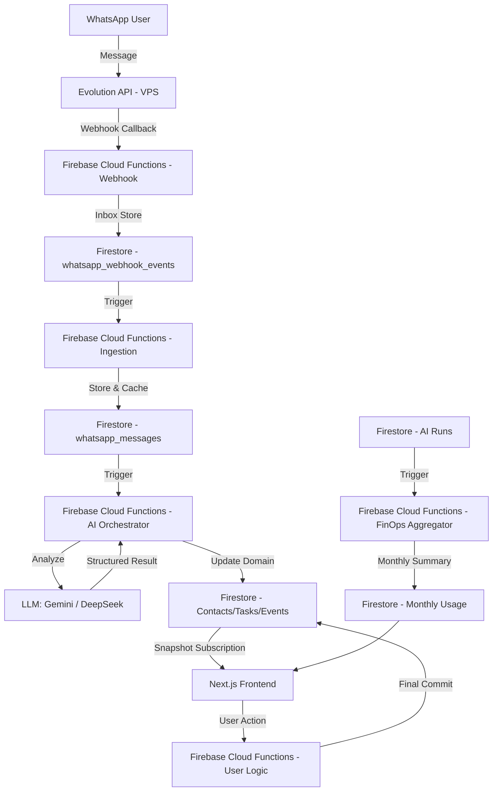

# Architecture Overview (System Technical Structure)

## System Components
### 1. Frontend: Next.js 15 (App Router)
- **Framework**: `Next.js 15` with `React`.
- **Styling**: `Tailwind CSS`, `shadcn/ui` for new components.
- **PWA**: PWA integration for mobile-first operational access.
- **State Management**: React Context, Firebase Hooks.
- **AI Integration**: Client-side Gemini SDK for immediate interaction.

### 2. Backend / Infrastructure: Firebase (Google Cloud)
- **Auth**: Firebase Authentication (Email/Password, Google).
- **Database**: `Cloud Firestore` (NoSQL).
- **Functions**: `Firebase Cloud Functions v2` (Node.js 20), `onDocumentCreated` triggers.
- **Storage**: `Firebase Storage` (for image uploads and WhatsApp text exports).
- **Hosting**: Firebase Hosting (Staging/Production).
- **Push**: `Firebase Cloud Messaging (FCM)` for notifications.

### 3. WhatsApp Integration: Evolution API (VPS Hosted)
- **Engine**: Evolution API (via Baileys/WhatsApp connectivity).
- **Host**: VPS instance, logically isolated from other projects.
- **Webhook Store**: External webhook receiver sends data to Firestore via Firebase Cloud Functions.

## Folder Structure
```markdown
/
├── app/                  # Next.js Application
│   ├── src/
│   │   ├── components/   # UI components (AddItemModal, AdminDashboard)
│   │   │   └── ui/       # shadcn/ui components
│   │   ├── hooks/        # Custom React hooks (AI, Firebase integration)
│   │   ├── lib/          # Code utilities (AI clients, Firebase SDK)
│   │   └── app/          # Next.js App Router (pages/routes)
│   ├── functions/        # Firebase Cloud Functions (Node.js)
│   ├── public/           # Static assets, Service Workers
│   └── .firebaserc       # Multi-project config (Staging/Production)
├── docs/                 # Documentation (MD files)
└── .github/workflows/    # CI/CD (GitHub Actions)
```

## Data Flow


1. **WhatsApp Webhook**: Incoming message from WhatsApp -> Evolution API (VPS) -> Webhook Endpoint (Cloud Functions).
2. **Message Ingestion**: Cloud Functions -> Save to Firestore (`webhooks` / `messages` collections).
3. **AI Processing (Async)**: Document trigger -> AI Orchestration -> Analyze content/context -> Update `contacts`/`tasks`/`events` collections.
4. **Frontend Update**: Firestore Snapshot Listener -> Real-time UI update in Next.js.
5. **Direct User Action**: User interacts on UI (e.g., approve action) -> Request to Cloud Functions -> Final database update.

## Key Architectural Patterns
- **Expansion Track Separation**: Strict adherence to logically separating new modules from legacy inventory.
- **AI Orchestrator**: Logic to `plan`, `execute`, `query context`, and `write results` to ensure trackability.
- **Approval-First AI**: Human-in-the-loop requirement for tasks with high cost or business impact.
- **Tenant Isolation**: Currently single-tenant with logical account separation (preparatory for future multi-tenancy).
- **TDD (Test-Driven Development)**: All expansion features must be verified by `Jest` tests before PR.

## Integration Points
- **Gemini API**: Used for complex extraction, summaries, and multimodal reasoning.
- **DeepSeek API**: Proposed backend logic for high-volume, low-cost extraction.
- **Evolution API (WhatsApp)**: Dedicated WhatsApp instance management and message stream.
- **Metadata Caching**: Dedicated `whatsapp_groups` collection and Evolution API `/group/findGroupInfos` endpoint used to resolve JIDs to human-readable names.

## Core Schemas (AI Orchestrator)
The AI Orchestrator follows a structured "Plan-Execute" pattern.

### AI Task Plan Schema
```json
{
  "taskType": "string (e.g., 'extract_crm_events')",
  "targetId": "string (document ID)",
  "status": "pending | approved | executing | completed | failed",
  "costEstimation": {
    "model": "string",
    "inputTokens": "number",
    "outputTokens": "number",
    "costUSD": "number"
  },
  "context": {
    "sources": ["array of source IDs"],
    "promptVersion": "string"
  }
}
```

### AI Run Ledger Schema
```json
{
  "taskId": "string (plan ID)",
  "actualCost": {
    "inputTokens": "number",
    "outputTokens": "number",
    "costUSD": "number"
  },
  "lineage": {
    "rawInput": "string (path or ID)",
    "piiRedacted": "boolean"
  },
  "result": "object (structured output)"
}
```

### Monthly Usage Summary Schema (FinOps)
Location: `system_usage/ai_usage_summary_{YYYYMM}`
```json
{
  "month": "YYYYMM",
  "totalCostUsd": "number (incremented)",
  "totalTokens": "number (incremented)",
  "totalRequests": "number (incremented)",
  "tasks": {
    "whatsapp_extraction": {
      "cost": "number",
      "count": "number"
    }
  },
  "updatedAt": "serverTimestamp"
}
```

### System Audit Log Schema
Location: `system_audit_logs/{id}`
```json
{
  "category": "security | finops | data | system",
  "action": "string (action identifier)",
  "actorId": "string (uid or 'system')",
  "severity": "info | warning | critical",
  "details": "object (contextual data)",
  "timestamp": "serverTimestamp"
}
```

## Technical Reference
- **Project Context**: [agent_context.md](file:///Users/juliocezar/Dev/personal/InventoryOS/docs/agent_context.md)
- **Decision Log**: [decisions.md](file:///Users/juliocezar/Dev/personal/InventoryOS/docs/decisions.md)
- **WhatsApp Integration Details**: [whatsapp-integration.md](file:///Users/juliocezar/Dev/personal/InventoryOS/docs/whatsapp-integration.md)
- **Evolution Plan**: [expansion-track-plan.md](file:///Users/juliocezar/Dev/personal/InventoryOS/docs/expansion-track-plan.md)
