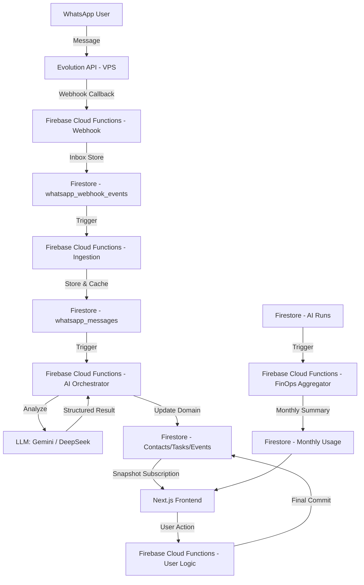

# Architecture Overview (System Technical Structure)

## System Components
### 1. Frontend: Next.js 15 (App Router)
- **Framework**: `Next.js 15` with `React`.
- **Styling**: `Tailwind CSS`, `shadcn/ui` for new components.
- **PWA**: PWA integration for mobile-first operational access.
- **State Management**: React Context, Firebase Hooks.
- **AI Integration**: Client-side Gemini SDK for immediate interaction.

### 2. Backend / Infrastructure: Firebase (Google Cloud)
- **Auth**: Firebase Authentication (Email/Password, Google).
- **Database**: `Cloud Firestore` (NoSQL).
- **Functions**: `Firebase Cloud Functions v2` (Node.js 20), `onDocumentCreated` triggers.
- **Storage**: `Firebase Storage` (for image uploads and WhatsApp text exports).
- **Hosting**: Firebase Hosting (Staging/Production).
- **Push**: `Firebase Cloud Messaging (FCM)` for notifications.

### 3. WhatsApp Integration: Evolution API (VPS Hosted)
- **Engine**: Evolution API (via Baileys/WhatsApp connectivity).
- **Host**: VPS instance, logically isolated from other projects.
- **Webhook Store**: External webhook receiver sends data to Firestore via Firebase Cloud Functions.

### 4. Product Catalog Enrichment: Open Icecat (free catalog)
- **Provider**: Open Icecat free catalog, queried server-side by GTIN/EAN/UPC or manufacturer part number.
- **Trigger**: Firestore `inventory/{itemId}` write trigger runs on product creation and when identifying fields change.
- **Storage**: Enrichment metadata, source URL, confidence, structured technical specifications, datasheet and manual links remain on the inventory item.
- **Safety**: Exact or high-confidence matches are applied automatically; manually entered product fields are never overwritten.

## Folder Structure
```markdown
/
├── app/                  # Next.js Application
│   ├── src/
│   │   ├── components/   # UI components (AddItemModal, AdminDashboard)
│   │   │   └── ui/       # shadcn/ui components
│   │   ├── hooks/        # Custom React hooks (AI, Firebase integration)
│   │   ├── lib/          # Code utilities (AI clients, Firebase SDK)
│   │   └── app/          # Next.js App Router (pages/routes)
│   ├── functions/        # Firebase Cloud Functions (Node.js)
│   ├── public/           # Static assets, Service Workers
│   └── .firebaserc       # Multi-project config (Staging/Production)
├── docs/                 # Documentation (MD files)
└── .github/workflows/    # CI/CD (GitHub Actions)
```

## Data Flow

```mermaid
graph TD
    WA[WhatsApp User] -->|Message| EVO[Evolution API - VPS]
    EVO -->|Webhook Callback| CF_IN[Firebase Cloud Functions - Webhook]
    CF_IN -->|Inbox Store| DB_WEB[Firestore - whatsapp_webhook_events]
    DB_WEB -->|Trigger| CF_MSG[Firebase Cloud Functions - Ingestion]
    CF_MSG -->|Store & Cache| DB_MSG[Firestore - whatsapp_messages]
    DB_MSG -->|Trigger| CF_AI[Firebase Cloud Functions - AI Orchestrator]
    CF_AI -->|Analyze| AI[LLM: Gemini / DeepSeek]
    AI -->|Structured Result| CF_AI
    CF_AI -->|Update Domain| DB_DOM[Firestore - Contacts/Tasks/Events]
    DB_DOM -->|Snapshot Subscription| FE[Next.js Frontend]
    FE -->|User Action| CF_ACT[Firebase Cloud Functions - User Logic]
    CF_ACT -->|Final Commit| DB_DOM
    DB_AI[Firestore - AI Runs] -->|Trigger| CF_FIN[Firebase Cloud Functions - FinOps Aggregator]
    CF_FIN -->|Monthly Summary| DB_FIN[Firestore - Monthly Usage]
    DB_FIN --> FE
```

1. **WhatsApp Webhook**: Incoming message from WhatsApp -> Evolution API (VPS) -> Webhook Endpoint (Cloud Functions).
2. **Message Ingestion**: Cloud Functions -> Save to Firestore (`webhooks` / `messages` collections).
3. **AI Processing (Async)**: Document trigger -> AI Orchestration -> Analyze content/context -> Update `contacts`/`tasks`/`events` collections.
4. **Frontend Update**: Firestore Snapshot Listener -> Real-time UI update in Next.js.
5. **Direct User Action**: User interacts on UI (e.g., approve action) -> Request to Cloud Functions -> Final database update.

## Key Architectural Patterns
- **Expansion Track Separation**: Strict adherence to logically separating new modules from legacy inventory.
- **AI Orchestrator**: Logic to `plan`, `execute`, `query context`, and `write results` to ensure trackability.
- **Approval-First AI**: Human-in-the-loop requirement for tasks with high cost or business impact.
- **Tenant Isolation**: Currently single-tenant with logical account separation (preparatory for future multi-tenancy).
- **TDD (Test-Driven Development)**: All expansion features must be verified by `Jest` tests before PR.

## Access Control and Workspace Isolation

- Firebase Auth remains the identity provider; Google sign-in is not sufficient to unlock data.
- The callable `initializeAccessProfile` creates a server-owned profile with `accessStatus: pending` for new users. Only an approved admin can approve or revoke another user through `approveAccessRequest` or `revokeAccess`.
- Approved status, admin role, and `workspaceId` are mirrored into Firebase custom claims. Firestore rules require `accessApproved == true` and the same workspace for shared Expansion Track data.
- `/system/access_control` is server-only. The platform owner is resolved from the `PLATFORM_OWNER_EMAIL` secret, stored server-side, and omitted from access-management responses and visible identity surfaces. The initial visible administrator is resolved from the `PLATFORM_ADMIN_EMAIL` secret and receives the same approved workspace boundary.
- `in_app_notifications` is recipient-scoped and used to notify admins about requests and users about approval/revocation.
- Firebase Storage follows the same `accessApproved` claim gate; unauthenticated and pending/revoked users cannot read or upload files.

## CRM v1 Data Flow

The CRM uses `accounts` as companies and `contacts` as people. Each record carries `workspaceId`; contacts also carry `companyId`, role, locality, normalized phone digits, optional `phoneNumbers`/`phoneDigitsList`/`whatsappPhoneDigits` arrays, and optional `whatsappRemoteJid` for legacy/inbound linkage. Company records may carry a structured `address` object.

1. Approved user creates a company/contact from the CRM screen.
2. A manual interaction writes an immutable `crm_events` record and updates the contact's last/next contact fields.
3. Equipment links write to `interests` or `installed_base`, referencing catalog type/brand/model when available.
4. After the asynchronous WhatsApp Inbox/AI pipeline completes, the backend resolves a CRM contact by remote ID, primary normalized phone, or a matching additional phone. A match creates a WhatsApp timeline event, links extracted opportunities/tasks/events, and applies an AI next-contact date only if no manual next-contact date exists.

### CRM Performance Dashboard

The administrative CRM performance surface reads workspace-scoped `crm_events`, `contacts`, `accounts`, and approved access summaries. The employee comparison is attributed by `actorUserId` (falling back to `ownerId` only when it is not a system actor), while automated/system activity is retained in an explicit `Sem atribuição` row instead of being assigned to a person.

The initial KPI contract is:

- `Ligações registradas`: CRM events with `channelType == "phone"` in the selected period.
- `Interações totais`: CRM events with `eventType == "contact_interaction"` in the selected period. Legacy events with a channel but no `eventType` remain compatible; extracted milestones are not double-counted as interactions.
- `Contatos alcançados`: distinct `contactId` values (or linked `remoteJid` when no contact ID exists).
- `Follow-ups agendados`: period interactions with a valid `nextContactAt`.
- `Follow-ups vencidos`: active contacts whose current `nextContactAt` is before the dashboard reference time.

The dashboard intentionally does not infer call duration, connection rate, outcome, conversion, or revenue attribution because those fields are not present in the CRM v1 records. `crmPerformanceDashboard` controls the admin navigation entry and can be disabled through `system/feature_flags`.

## Integration Points
- **Gemini API**: Used for complex extraction, summaries, and multimodal reasoning.
- **DeepSeek API**: Proposed backend logic for high-volume, low-cost extraction.
- **Evolution API (WhatsApp)**: Dedicated WhatsApp instance management and message stream.
- **Metadata Caching**: Dedicated `whatsapp_groups` collection and Evolution API `/group/findGroupInfos` endpoint used to resolve JIDs to human-readable names.
- **Open Icecat**: Free product catalog used to enrich legacy `inventory` records by GTIN, part number, brand and model. Lookup metadata is persisted under `metadata.catalogEnrichment`.

## Core Schemas (AI Orchestrator)
The AI Orchestrator follows a structured "Plan-Execute" pattern.

### AI Task Plan Schema
```json
{
  "taskType": "string (e.g., 'extract_crm_events')",
  "targetId": "string (document ID)",
  "status": "pending | approved | executing | completed | failed",
  "costEstimation": {
    "model": "string",
    "inputTokens": "number",
    "outputTokens": "number",
    "costUSD": "number"
  },
  "context": {
    "sources": ["array of source IDs"],
    "promptVersion": "string"
  }
}
```

### AI Run Ledger Schema
```json
{
  "taskId": "string (plan ID)",
  "actualCost": {
    "inputTokens": "number",
    "outputTokens": "number",
    "costUSD": "number"
  },
  "lineage": {
    "rawInput": "string (path or ID)",
    "piiRedacted": "boolean"
  },
  "result": "object (structured output)"
}
```

### Monthly Usage Summary Schema (FinOps)
Location: `system_usage/ai_usage_summary_{YYYYMM}`
```json
{
  "month": "YYYYMM",
  "totalCostUsd": "number (incremented)",
  "totalTokens": "number (incremented)",
  "totalRequests": "number (incremented)",
  "tasks": {
    "whatsapp_extraction": {
      "cost": "number",
      "count": "number"
    }
  },
  "updatedAt": "serverTimestamp"
}
```

### System Audit Log Schema
Location: `system_audit_logs/{id}`
```json
{
  "category": "security | finops | data | system",
  "action": "string (action identifier)",
  "actorId": "string (uid or 'system')",
  "severity": "info | warning | critical",
  "details": "object (contextual data)",
  "timestamp": "serverTimestamp"
}
```

## Technical Reference
- **Project Context**: [agent_context.md](file:///Users/juliocezar/Dev/personal/InventoryOS/docs/agent_context.md)
- **Decision Log**: [decisions.md](file:///Users/juliocezar/Dev/personal/InventoryOS/docs/decisions.md)
- **WhatsApp Integration Details**: [whatsapp-integration.md](file:///Users/juliocezar/Dev/personal/InventoryOS/docs/whatsapp-integration.md)
- **Evolution Plan**: [expansion-track-plan.md](file:///Users/juliocezar/Dev/personal/InventoryOS/docs/expansion-track-plan.md)

## CRM Import Architecture

The CRM migration flow is intentionally server-owned. The browser creates an import job through `createCrmImportJob`, uploads the source file to a workspace-scoped Storage path, calls `validateCrmImport`, and only then calls `confirmCrmImport`. The parser accepts Excel and CSV through the same normalization path, preserves source row numbers, validates required identity fields, normalizes dates/e-mails/phones, counts repeated identities, and upserts in bounded Firestore batches. `crm_import_jobs` stores only the preview, validation report and audit metadata; the original file has a 90-day retention policy enforced by `cleanupCrmImportFiles`.

## Human-in-the-loop CRM Automation

The WhatsApp batch pipeline still stores an immutable CRM timeline event, but opportunity/task/interest writeback is guarded by `crmAiWorkflow`. In the guarded path, it writes `crm_review_items` with source message IDs, AI run ID, confidence, contact/company linkage and a proposed domain payload. `approveCrmReviewItem` materializes the correct domain record and records the approving user; `rejectCrmReviewItem` closes the suggestion without mutating CRM state. Firestore rules make the collection read-only to clients, so the approval trail cannot be bypassed with direct writes.

## AI Gateway and Cost Ledger

Client-side extraction delegates to `runAiExtraction` whenever the Firebase Functions client is configured. The callable enforces approved access, payload limits, allowed model prefixes and the monthly budget kill switch through the existing planner. Each run persists provider, model, pricing source/version, estimated tokens, measured usage and calculated token cost in `ai_runs`; `aggregateAiUsage` maintains the monthly summary used by Admin. This is a token-cost ledger, distinct from the official provider invoice; the optional Billing Export reconciler supplies that second source when configured.

The optional `reconcileAiBillingExport` scheduled function queries a configured BigQuery Billing Export table once per day, filters AI services, normalizes gross cost and credits, and stores monthly official totals in `system_billing_reconciliation` and `system_usage`. Missing `BILLING_EXPORT_PROJECT_ID`, `BILLING_EXPORT_DATASET` or `BILLING_EXPORT_TABLE` disables the job safely, so local and unconfigured staging environments continue to work without BigQuery access.
