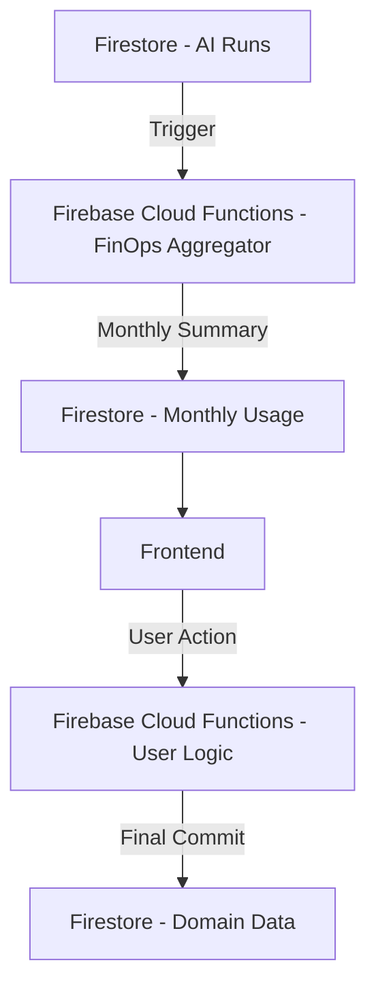

---
active_decisions:
  - id: shadcn_ui
    name: Use shadcn/ui for Expansion Track
    status: Active
  - id: expansion_tdd
    name: TDD for Expansion Track
    status: Active
  - id: evolution_api
    name: WhatsApp via Evolution API (VPS)
    status: Active
  - id: custom_ai_orchestrator
    name: Custom AI Orchestrator Layer
    status: Active
  - id: multi_model_strategy
    name: DeepSeek (Default) + Gemini (Escalation)
    status: Active
  - id: client_side_gemini
    name: Direct Gemini API Calls (Client-Side)
    status: Active
  - id: lint_only_changed
    name: ESLint on Changed Files Only
    status: Active
  - id: whatsapp_metadata_cache
    name: WhatsApp Group Metadata Caching
    status: Active
  - id: dual_status_monitor
    name: Dual-Status (Webhook/AI) Monitoring
    status: Active
  - id: finops_realtime_aggregation
    name: Real-time AI Cost Aggregation
    status: Active
  - id: typescript_migration
    name: Gradual Migration to TypeScript
    status: Active
  - id: ai_cost_reduction
    name: AI Cost Reduction - Relevance Filter & Batching
    status: Active
---

# Technical Decisions Log (ADR)

## Decision: AI Cost Reduction - Relevance Filter & Batching
- **Decision**: Implement a Layer 0 Relevance Filter to only process messages from contacts/groups explicitly marked as "active" in the Review Queue.
- **Reason**: Processing high volumes of WhatsApp messages with LLMs generates unpredictable and potentially high costs. Filtering noise ensures we only extract transactions from relevant sources.
- **Implications**: Requires users to manually activate monitoring for a contact/group before AI extraction occurs.
- **Status**: Active.

## FinOps Architecture Overview

### AI Cost Aggregation Flow


### Monthly Usage Summary Schema (FinOps)
Location: `system_usage/ai_usage_summary_{YYYYMM}`
```json
{
  "month": "YYYYMM",
  "totalCostUsd": "number (incremented)",
  "totalTokens": "number (incremented)",
  "totalRequests": "number (incremented)",
  "tasks": {
    "whatsapp_extraction": {
      "cost": "number",
      "count": "number"
    }
  },
  "updatedAt": "serverTimestamp"
}
```

## Decision: Adopt `shadcn/ui` for Expansion Track
- **Decision**: All new user interface components part of the Expansion Track must use `shadcn/ui`.
- **Reason**: Standardize the modern look and feel of the new modules while speeding up UI development using accessible, production-ready components.
- **Implications**: Legacy UI components (Inventory) will coexist; gradual migration is encouraged when updating existing screens.
- **Status**: Active.

## Decision: Test-Driven Development (TDD) for Expansion Features
- **Decision**: Mandatory TDD for any new feature in the `Expansion Track`.
- **Reason**: Ensure system reliability, prevent regressions in the production inventory system, and maintain high code quality as complexity grows.
- **Implications**: Development speed may be perceived as slower in the short term, but maintenance burden and bug count are significantly reduced.
- **Status**: Active.

## Decision: Evolution API for WhatsApp Integration
- **Decision**: Use `Evolution API` (v2) hosted on a VPS for WhatsApp connectivity.
- **Reason**: Provides a robust, multi-instance, and feature-rich interface for WhatsApp (via Baileys) without the overhead or restrictions of the official Meta API.
- **Implications**: Requires managing a VPS; necessity for logical isolation from other projects.
- **Status**: Active.

## Decision: AI Orchestrator (Custom Implementation)
- **Decision**: Avoid using complex frameworks like `LangChain` or `Agno`. Build a custom, lightweight AI Orchestrator.
- **Reason**: Maximize predictability, simplify testing, and ensure full control over the AI's execution flow (plan, execute, query, write).
- **Implications**: Custom implementation of prompt versioning, cost tracking, and lineage logic.
- **Status**: Active.

## Decision: Multi-Model Strategy (DeepSeek / Gemini)
- **Decision**: Use `DeepSeek` as the default backend model and `Gemini` as an escalation path.
- **Reason**: Optimize for cost (DeepSeek) while maintaining high capability for complex, large-context, or multimodal tasks (Gemini).
- **Implications**: Requires abstraction layer for switching models and tracking specific performance/costs.
- **Status**: Active.

## Decision: Direct Gemini API Calls (Client-Side)
- **Decision**: Call Gemini API directly from the client using `NEXT_PUBLIC_GEMINI_API_KEY`.
- **Reason**: Faster interaction for the user and reduced load on server-side functions for simple AI tasks.
- **Implications**: API key security must be monitored (client-side restriction); high-volume tasks should remain server-side.
- **Status**: Active.

## Decision: ESLint on Changed Files Only
- **Decision**: CI only runs ESLint on files that were modified in the PR.
- **Reason**: Large technical debt in the legacy codebase makes a full repository lint scan impractical and noisy for PRs.
- **Implications**: Developers must ensure new code is clean and adheres to standards without being forced to fix old code.
- **Status**: Active.

## Decision: WhatsApp Group Metadata Caching
- **Decision**: Use a dedicated Firestore collection `whatsapp_groups` to cache human-readable group names against their JIDs.
- **Reason**: Evolution API message payloads (`messages.upsert`) typically provide only the identifier, making the activity monitor hard to read without a lookup table.
- **Implications**: Requires a multi-tier resolution strategy: checking incoming payload -> Firestore cache -> Evolution API `findGroupInfos` endpoint. Significantly improves UI observability and log clarity.
- **Status**: Active.

## Decision: Dual-Status Activity Monitoring
- **Decision**: Split the message status display into "Network/Webhook" (reception state) and "AI Processing" (extraction state).
- **Reason**: Decouples the message storage from the expensive/async AI processing, providing clear feedback on where a message is in the pipeline.
- **Implications**: Unified activity monitor becomes the source of truth for message digestion status.
- **Status**: Active.

## Decision: Real-time AI Cost Aggregation (FinOps)
- **Decision**: Implement a background aggregator (`aggregateAiUsage` function) that updates a single monthly summary document whenever an AI task completes.
- **Reason**: Querying thousands of individual `ai_runs` logs in the frontend is expensive (read costs) and slow. A summarized document allows for instant, cheap dashboard loading.
- **Implications**: Enables "Run-rate" projections and real-time budget monitoring without impacting Firebase performance or cost significantly.
- **Status**: Active.

## Decision: Gradual Migration to TypeScript
- **Decision**: All new features and modules in the `Expansion Track` must be written in TypeScript (`.ts` / `.tsx`). Legacy modules in JavaScript will coexist and be migrated incrementally when major changes occur.
- **Reason**: 
    - **Reliability**: Complex AI payloads and domain-heavy CRM entities (Contacts, Opportunities, Tasks) require strict type safety to prevent runtime errors.
    - **Maintainability**: Clear interfaces for the AI Orchestrator and Evolution API facilitate code reuse and safer refactoring.
    - **Developer Productivity**: Immediate IntelliSense feedback and compile-time validation of Firestore documents.
- **Implications**: 
    - Requires setting up a root `tsconfig.json` and configuring Next.js/Firebase Functions to support TS.
    - Potential friction when legacy JS components interact with TS-first modules; uses of `any` or `@ts-ignore` should be minimized but are permissible as a migration bridge.
- **Status**: Active.

## Technical Reference
- **Project Context**: [agent_context.md](file:///Users/juliocezar/Dev/personal/InventoryOS/docs/agent_context.md)
- **Architecture Overview**: [architecture.md](file:///Users/juliocezar/Dev/personal/InventoryOS/docs/architecture.md)
- **Expansion Track Plan**: [expansion-track-plan.md](file:///Users/juliocezar/Dev/personal/InventoryOS/docs/expansion-track-plan.md)
