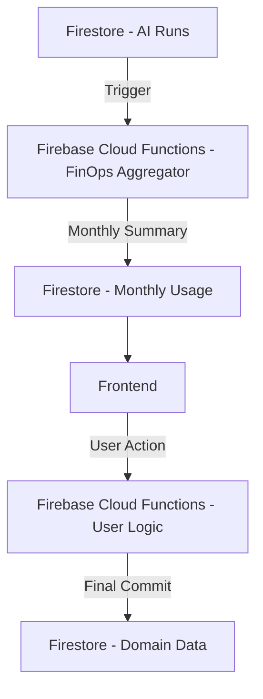

---
active_decisions:
  - id: shadcn_ui
    name: Use shadcn/ui for Expansion Track
    status: Active
  - id: expansion_tdd
    name: TDD for Expansion Track
    status: Active
  - id: evolution_api
    name: WhatsApp via Evolution API (VPS)
    status: Active
  - id: custom_ai_orchestrator
    name: Custom AI Orchestrator Layer
    status: Active
  - id: multi_model_strategy
    name: DeepSeek (Default) + Gemini (Escalation)
    status: Active
  - id: client_side_gemini
    name: Direct Gemini API Calls (Client-Side)
    status: Active
  - id: lint_only_changed
    name: ESLint on Changed Files Only
    status: Active
  - id: whatsapp_metadata_cache
    name: WhatsApp Group Metadata Caching
    status: Active
  - id: dual_status_monitor
    name: Dual-Status (Webhook/AI) Monitoring
    status: Active
  - id: finops_realtime_aggregation
    name: Real-time AI Cost Aggregation
    status: Active
  - id: typescript_migration
    name: Gradual Migration to TypeScript
    status: Active
  - id: ai_cost_reduction
    name: AI Cost Reduction - Relevance Filter & Batching
    status: Active
  - id: webhook_async_buffer
    name: Async Webhook Buffering (Inbox Pattern)
    status: Active
  - id: unified_observability_wrapper
    name: Unified Error Handling & Structured Logging
    status: Active
  - id: finops_kill_switch
    name: FinOps Monthly Budget Kill Switch
    status: Active
  - id: access_approval_gate
    name: Server-owned access approval and workspace claims
    status: Active
  - id: crm_company_contact_history
    name: Company/contact CRM with immutable interaction history
    status: Active
---

# Technical Decisions Log (ADR)

## Decision: AI Cost Reduction - Relevance Filter & Batching
- **Decision**: Implement a Layer 0 Relevance Filter to only process messages from contacts/groups explicitly marked as "active" in the Review Queue.
- **Reason**: Processing high volumes of WhatsApp messages with LLMs generates unpredictable and potentially high costs. Filtering noise ensures we only extract transactions from relevant sources.
- **Implications**: Requires users to manually activate monitoring for a contact/group before AI extraction occurs.
- **Status**: Active.

## Decision: Server-owned access approval and workspace claims
- **Decision**: Treat Google authentication as identity only. New users remain `pending` until an approved admin changes the status, and Firestore access is gated by server-issued `accessApproved`, `accessAdmin`, and `workspaceId` claims.
- **Reason**: Prevent authenticated-but-unapproved users from reading or mutating inventory and CRM data, while keeping approval inside the platform.
- **Implications**: Production requires `PLATFORM_OWNER_EMAIL`, `PLATFORM_ADMIN_EMAIL`, and a stable `PLATFORM_WORKSPACE_ID` configured as Firebase Function secrets. The owner is deliberately excluded from access lists and identity UI, while the configured administrator is visible and can be managed by the owner.
- **Status**: Active.

## Decision: Company/contact CRM with immutable interaction history
- **Decision**: Model `accounts` as companies, `contacts` as people, and `crm_events` as the interaction timeline. Equipment relationships use `interests` and `installed_base`; WhatsApp matching uses explicit remote ID first, then primary or additional normalized phone digits.
- **Reason**: Preserve the customer's spreadsheet shape while supporting multiple contacts per company, roles, follow-up dates, full company addresses, multiple communication channels, equipment context, and asynchronous WhatsApp enrichment.
- **Implications**: The UI uses a contact list/detail flow with modal creation and progressive company autocomplete. WhatsApp status is captured per phone and the backend derives matching fields; the UI does not expose a remote ID field. Manual next-contact dates cannot be overwritten by AI. WhatsApp enrichment is applied only when a CRM contact is linked, and all records carry the shared `workspaceId` boundary.
- **Status**: Active.

## Decision: Build-time Firebase configuration per environment
- **Decision**: Inject the public Firebase web configuration during each static frontend build, using the staging project for staging hosting and the production project for production hosting.
- **Reason**: The exported Next.js bundle cannot resolve runtime Firebase environment variables in the browser. Missing values leave Firebase Auth uninitialized and make the Google login action appear unresponsive.
- **Implications**: `NEXT_PUBLIC_FIREBASE_*` values are deployment inputs, not committed secrets. Production and staging must be built separately or with explicit environment injection; the login flow also falls back to redirect when browser pop-ups are blocked.
- **Status**: Active.

## Decision: Local-only development auth bypass
- **Decision**: Development can use a fake approved administrator when `NEXT_PUBLIC_LOCAL_AUTH_BYPASS=true` is loaded from the ignored `.env.development.local` file. The bypass is additionally restricted to `NODE_ENV=development`.
- **Reason**: Allow fast local UI/flow validation without requiring Google OAuth or an approved Firebase account.
- **Implications**: Firebase initialization is disabled while the bypass is active, preventing the fake user from reading or writing staging/production data. Production builds cannot activate this path.
- **Status**: Active.

## Decision: CRM performance attribution and KPI contract
- **Decision**: Attribute employee performance from `crm_events.actorUserId`, fall back to a non-system `ownerId` only when necessary, and keep system/unknown activity under an explicit unassigned bucket. The first dashboard KPI set is registered calls, explicit `contact_interaction` events, distinct contacts reached, scheduled follow-ups, overdue follow-ups, channel mix, and attribution coverage.
- **Reason**: CRM v1 records do not yet contain call duration, connection state, call outcome, conversion, or revenue attribution. The dashboard must remain source-backed and avoid presenting inferred business performance as fact.
- **Implications**: Automated WhatsApp activity is visible but does not inflate an employee's ranking. Adding conversion or quality KPIs requires new captured fields and tests before the dashboard contract is expanded.
- **Status**: Active.

## FinOps Architecture Overview

### AI Cost Aggregation Flow

```mermaid
graph TD
    FE[Frontend]
    CF_ACT[Firebase Cloud Functions - User Logic]
    DB_DOM[Firestore - Domain Data]
    DB_AI[Firestore - AI Runs]
    CF_FIN[Firebase Cloud Functions - FinOps Aggregator]
    DB_FIN[Firestore - Monthly Usage]

    FE -->|User Action| CF_ACT
    CF_ACT -->|Final Commit| DB_DOM
    DB_AI -->|Trigger| CF_FIN
    CF_FIN -->|Monthly Summary| DB_FIN
    DB_FIN --> FE
```

### Monthly Usage Summary Schema (FinOps)
Location: `system_usage/ai_usage_summary_{YYYYMM}`
```json
{
  "month": "YYYYMM",
  "totalCostUsd": "number (incremented)",
  "totalTokens": "number (incremented)",
  "totalRequests": "number (incremented)",
  "tasks": {
    "whatsapp_extraction": {
      "cost": "number",
      "count": "number"
    }
  },
  "updatedAt": "serverTimestamp"
}
```

## Decision: Adopt `shadcn/ui` for Expansion Track
- **Decision**: All new user interface components part of the Expansion Track must use `shadcn/ui`.
- **Reason**: Standardize the modern look and feel of the new modules while speeding up UI development using accessible, production-ready components.
- **Implications**: Legacy UI components (Inventory) will coexist; gradual migration is encouraged when updating existing screens.
- **Status**: Active.

## Decision: Test-Driven Development (TDD) for Expansion Features
- **Decision**: Mandatory TDD for any new feature in the `Expansion Track`.
- **Reason**: Ensure system reliability, prevent regressions in the production inventory system, and maintain high code quality as complexity grows.
- **Implications**: Development speed may be perceived as slower in the short term, but maintenance burden and bug count are significantly reduced.
- **Status**: Active.

## Decision: Evolution API for WhatsApp Integration
- **Decision**: Use `Evolution API` (v2) hosted on a VPS for WhatsApp connectivity.
- **Reason**: Provides a robust, multi-instance, and feature-rich interface for WhatsApp (via Baileys) without the overhead or restrictions of the official Meta API.
- **Implications**: Requires managing a VPS; necessity for logical isolation from other projects.
- **Status**: Active.

## Decision: AI Orchestrator (Custom Implementation)
- **Decision**: Avoid using complex frameworks like `LangChain` or `Agno`. Build a custom, lightweight AI Orchestrator.
- **Reason**: Maximize predictability, simplify testing, and ensure full control over the AI's execution flow (plan, execute, query, write).
- **Implications**: Custom implementation of prompt versioning, cost tracking, and lineage logic.
- **Status**: Active.

## Decision: Multi-Model Strategy (DeepSeek / Gemini)
- **Decision**: Use `DeepSeek` as the default backend model and `Gemini` as an escalation path.
- **Reason**: Optimize for cost (DeepSeek) while maintaining high capability for complex, large-context, or multimodal tasks (Gemini).
- **Implications**: Requires abstraction layer for switching models and tracking specific performance/costs.
- **Status**: Active.

## Decision: Direct Gemini API Calls (Client-Side)
- **Decision**: Call Gemini API directly from the client using `NEXT_PUBLIC_GEMINI_API_KEY`.
- **Reason**: Faster interaction for the user and reduced load on server-side functions for simple AI tasks.
- **Implications**: API key security must be monitored (client-side restriction); high-volume tasks should remain server-side.
- **Status**: Active.

## Decision: ESLint on Changed Files Only
- **Decision**: CI only runs ESLint on files that were modified in the PR.
- **Reason**: Large technical debt in the legacy codebase makes a full repository lint scan impractical and noisy for PRs.
- **Implications**: Developers must ensure new code is clean and adheres to standards without being forced to fix old code.
- **Status**: Active.

## Decision: WhatsApp Group Metadata Caching
- **Decision**: Use a dedicated Firestore collection `whatsapp_groups` to cache human-readable group names against their JIDs.
- **Reason**: Evolution API message payloads (`messages.upsert`) typically provide only the identifier, making the activity monitor hard to read without a lookup table.
- **Implications**: Requires a multi-tier resolution strategy: checking incoming payload -> Firestore cache -> Evolution API `findGroupInfos` endpoint. Significantly improves UI observability and log clarity.
- **Status**: Active.

## Decision: Dual-Status Activity Monitoring
- **Decision**: Split the message status display into "Network/Webhook" (reception state) and "AI Processing" (extraction state).
- **Reason**: Decouples the message storage from the expensive/async AI processing, providing clear feedback on where a message is in the pipeline.
- **Implications**: Unified activity monitor becomes the source of truth for message digestion status.
- **Status**: Active.

## Decision: Real-time AI Cost Aggregation (FinOps)
- **Decision**: Implement a background aggregator (`aggregateAiUsage` function) that updates a single monthly summary document whenever an AI task completes.
- **Reason**: Querying thousands of individual `ai_runs` logs in the frontend is expensive (read costs) and slow. A summarized document allows for instant, cheap dashboard loading.
- **Implications**: Enables "Run-rate" projections and real-time budget monitoring without impacting Firebase performance or cost significantly.
- **Status**: Active.

## Decision: Gradual Migration to TypeScript
- **Decision**: All new features and modules in the `Expansion Track` must be written in TypeScript (`.ts` / `.tsx`). Legacy modules in JavaScript will coexist and be migrated incrementally when major changes occur.
- **Reason**: 
    - **Reliability**: Complex AI payloads and domain-heavy CRM entities (Contacts, Opportunities, Tasks) require strict type safety to prevent runtime errors.
    - **Maintainability**: Clear interfaces for the AI Orchestrator and Evolution API facilitate code reuse and safer refactoring.
    - **Developer Productivity**: Immediate IntelliSense feedback and compile-time validation of Firestore documents.
- **Implications**: 
    - Requires setting up a root `tsconfig.json` and configuring Next.js/Firebase Functions to support TS.
    - Potential friction when legacy JS components interact with TS-first modules; uses of `any` or `@ts-ignore` should be minimized but are permissible as a migration bridge.
- **Status**: Active.

## Decision: Async Webhook Buffering (Inbox Pattern)
- **Decision**: Refactor all webhooks to perform minimal work (reception + hashing) and save the payload to a "buffer" collection (`whatsapp_webhook_events`) before returning 200 OK.
- **Reason**: Ensures zero data loss if downstream processing (AI/Firestore triggers) lags or fails. Provides a clear retry path for ingestion.
- **Implications**: Decouples receipt from processing. Triggers now work on the buffered collection.
- **Status**: Active.

## Decision: Unified Observability Wrapper
- **Decision**: Every Cloud Function must be wrapped in `withHttpErrorHandling` or `withEventErrorHandling`. Logs must use `StructuredLogger`.
- **Reason**: Standardizes error responses (with Correlation IDs) and provides trace-ability across distributed logging.
- **Implications**: Simplifies error management; internal crashes are caught and attributed to trace IDs.
- **Status**: Active.

## Decision: FinOps Monthly Budget Kill Switch
- **Decision**: Implement a mandatory budget check in `aiTaskPlanner.ts` before any AI execution. If current month spend >= limit, the task fails with `budget_exceeded`.
- **Reason**: Prevents catastrophic cloud billing if an automated loop or malicious actor triggers high-volume AI calls.
- **Implications**: 
  - O orçamento é configurado no documento Firestore `system/config` (campo: `aiMonthlyBudgetLimitUsd`).
  - Se o documento não existir, o limite padrão é **$10.00 USD**.
  - Violações de limite geram um log de categoria `finops` na coleção `system_audit_logs`.
- **Status**: Active.

## Decision: Automatic free product catalog enrichment
- **Decision**: Enrich products in the legacy `inventory` collection automatically through the free Open Icecat catalog, using GTIN/EAN/UPC first and manufacturer part number or brand/model as fallbacks.
- **Reason**: Improve technical completeness without introducing a paid product-data API or allowing an AI model to invent specifications.
- **Implications**: New products and products whose identifying fields change are queried by a Firestore write trigger. The result stores provider, source URL, match method, confidence, structured specifications and lookup signature. Existing manually entered fields are preserved; products not found remain marked `not_found` for later manual enrichment.
- **Status**: Active.

## Decision: Server-owned CRM import with 90-day source retention
- **Decision**: CRM spreadsheet imports use callable functions for validation and commit. The browser uploads only to a workspace-scoped temporary path; normalized rows are confirmed explicitly and written in bounded server batches. Original files are retained for 90 days and then deleted by a scheduled cleanup.
- **Reason**: Keep parsing, deduplication and cross-record writes consistent across web and mobile clients, while preserving enough source material for support without creating a permanent document archive.
- **Implications**: The UI must show validation results before import. `crm_import_jobs` is read-only to clients and all mutations are callable-owned. Excel/CSV source data is never treated as trusted domain state until normalization and confirmation complete.
- **Status**: Active.

## Decision: Approval-first WhatsApp CRM writeback
- **Decision**: AI-extracted opportunities, tasks and cross-selling interests enter `crm_review_items` before creating operational CRM records when `crmAiWorkflow` is enabled. Approval and rejection are callable operations with actor and timestamp lineage.
- **Reason**: The requested workflow uses AI to identify needs and commercial opportunities, but the team must retain the final decision before customer-facing or operational records are created.
- **Implications**: WhatsApp timeline events may be written as historical context, while actionable records wait in Central de ações. Direct client writes to review items are prohibited by Firestore rules.
- **Status**: Active.

## Decision: Central AI gateway with measured-vs-estimated cost labels
- **Decision**: Configured browser AI requests use the `runAiExtraction` callable and the server planner. Cost records distinguish measured token usage from estimates and persist the pricing catalog source/version used for calculation.
- **Reason**: Prevent provider credentials from being part of the normal browser execution path and make every model call observable through one ledger. Token-based cost is more precise than fixed per-operation estimates but is still not a provider invoice.
- **Implications**: Firebase Functions and provider secrets must be configured for production AI. Official invoice reconciliation is optional and requires BigQuery Billing Export configuration. Direct client fallback is retained only for existing test/local compatibility when Functions are unavailable.
- **Follow-up implementation**: `reconcileAiBillingExport` now performs the optional BigQuery reconciliation when `BILLING_EXPORT_PROJECT_ID`, `BILLING_EXPORT_DATASET` and `BILLING_EXPORT_TABLE` are configured; the Admin UI keeps official cost distinct from token-ledger cost.
- **Follow-up implementation**: Optional provider secrets are not bound to callable Functions unless configured, so the absence of `DEEPSEEK_API_KEY` does not block a Gemini-only deployment.
- **Status**: Active.

## Technical Reference
- **Project Context**: [agent_context.md](file:///Users/juliocezar/Dev/personal/InventoryOS/docs/agent_context.md)
- **Architecture Overview**: [architecture.md](file:///Users/juliocezar/Dev/personal/InventoryOS/docs/architecture.md)
- **Expansion Track Plan**: [expansion-track-plan.md](file:///Users/juliocezar/Dev/personal/InventoryOS/docs/expansion-track-plan.md)
